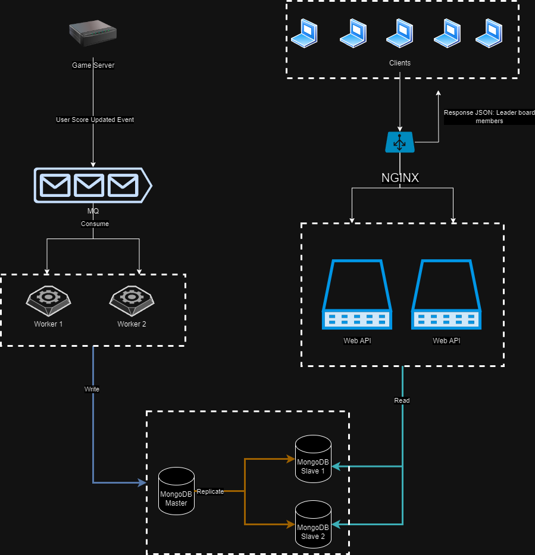

# Leaderboard Service

Leaderboard Service is a .NET-based application designed to provide score information for game users. The service connects to a Kafka event stream to process user score update events. Additionally, it offers an API endpoint to fetch leaderboard data.

## API Endpoint

### Get Leaderboard
```
GET http://localhost/leaderboards?page=1&pageSize=10
```

#### Response
```json
{
  "page": 1,
  "pageSize": 10,
  "totalPages": 1,
  "totalRecords": 1,
  "records": [
    {
      "userId": 767482,
      "scoreSummary": 16,
      "updatedAt": "2024-05-02T19:41:34.553Z",
      "id": "a222dc32-a991-4c08-8326-c06011a85500"
    }
  ]
}
```

## Architecture Design



The architecture prioritizes fault tolerance and horizontal scalability. The application comprises Web API Host containers, an Nginx load balancer, event listener workers, Kafka message queue, and MongoDB. MongoDB was chosen due to its suitability for storing large amounts of data extracted from streams, like Kafka.

For testing purposes, a mock game server was developed to send events to Kafka, informing about player point updates. The frequency of these messages can be adjusted using environment variables:

- `MinTimeout` (default: 3000 ms)
- `MaxTimeout` (default: 5000 ms)
- `MinEventsPerSecond` (default: 5)
- `MaxEventsPerSecond` (default: 10)

## How to Run

### Without Mock Server
1. Clone this repository.
2. Open a terminal in the local directory.
3. Run: `docker compose up`.

### With Mock Server
1. Clone this repository.
2. Open a terminal in the local directory.
3. Run: `docker-compose -f docker-compose-with-mock-server.yml up`.

### Running on Mac M1 without Mock Server
1. Clone this repository.
2. Open a terminal in the local directory.
3. Run: `docker-compose -f docker-compose-arm64.yml up`.

### Running on Mac M1 with Mock Server
1. Clone this repository.
2. Open a terminal in the local directory.
3. Run: `docker-compose -f docker-compose-with-mock-server-arm64.yml up`.